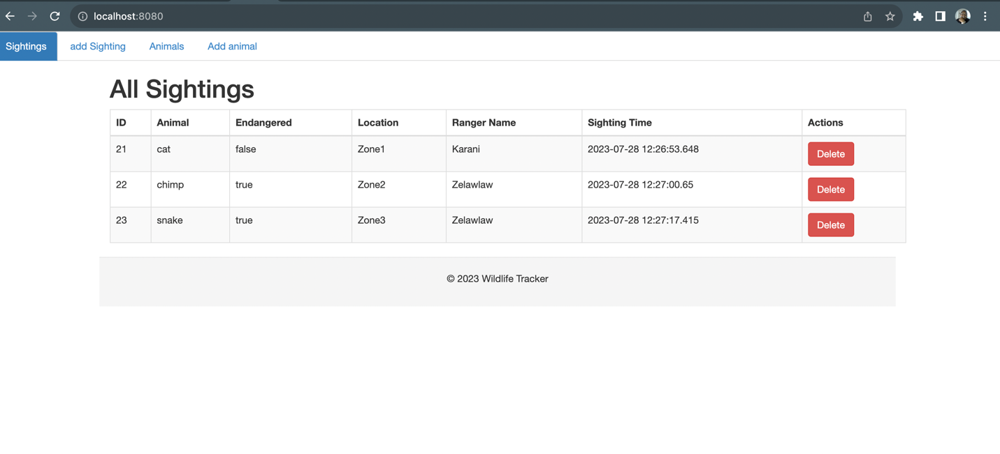

# Project : Wildlife Tracker

## Project description.

The project shows a web application that allows Rangers to track wildlife sightings in the area

## Author

### Lawrence Karani

## Setup instructions

- Clone the repository by running the following command
  > ```sh
  >    git clone https://github.com/Zelawlaw/WildlifeTracker.git
  > ```
- Create a database named wildlife_tracker on postgres
- ensure that the following entries on Application properties are entered.
- The note the entry  *spring.jpa.hibernate.ddl-auto* which is set to update and will genereate the database tables for
  you from the entities.

> ```sh
>/# PostgreSQL database connection properties
>spring.datasource.url=jdbc:postgresql://localhost:5432/wildlife_tracker
>spring.datasource.username=*your username*
>spring.datasource.password=*your password*
>spring.datasource.driver-class-name=org.postgresql.Driver
>/# Hibernate properties
>spring.jpa.hibernate.ddl-auto=update
>spring.jpa.properties.hibernate.dialect=org.hibernate.dialect.PostgreSQLDialect
> ```

- open the cloned repository folder in your favourite IDE and run the Main class.

## BDD

As a user, I would like to;

1) list, add and modify animals
2) record if animal is endangered or not.
3) list sightings of animals

## Expected view

Here is how it will look like upon successful installation


## Technologies used.

- Spring boot
- Gradle
- Lombok
- CSS
- Mustache
- PostGreSQL

## Contact information.

lawrence.karani@student.moringaschool.com

## License and Copyright information.

[MIT License](https://github.com/nishanths/license/blob/master/LICENSE)